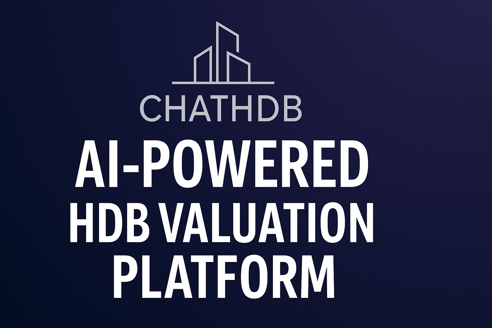
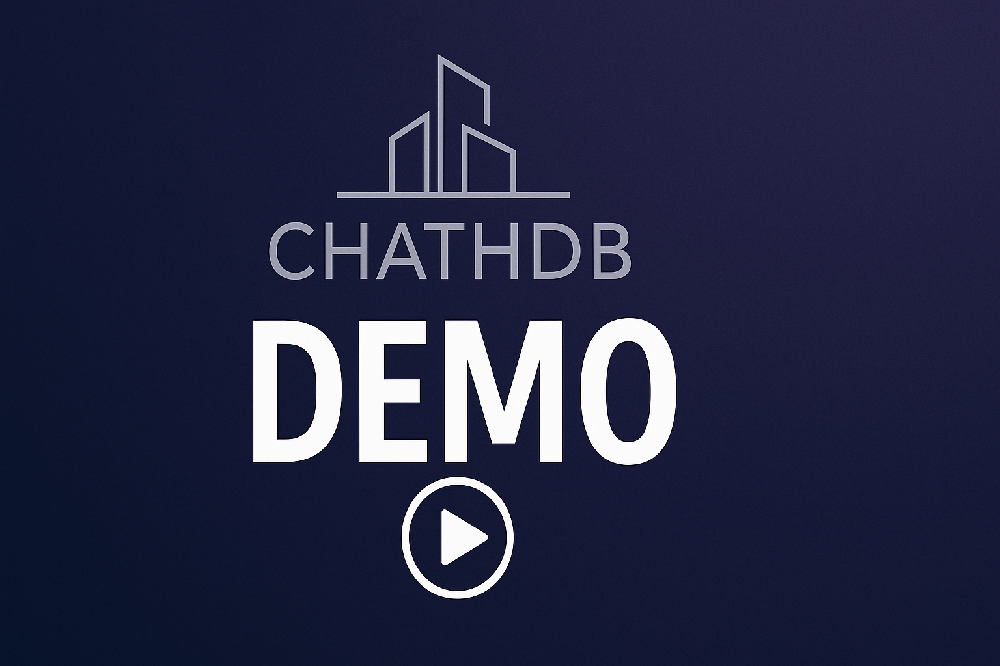
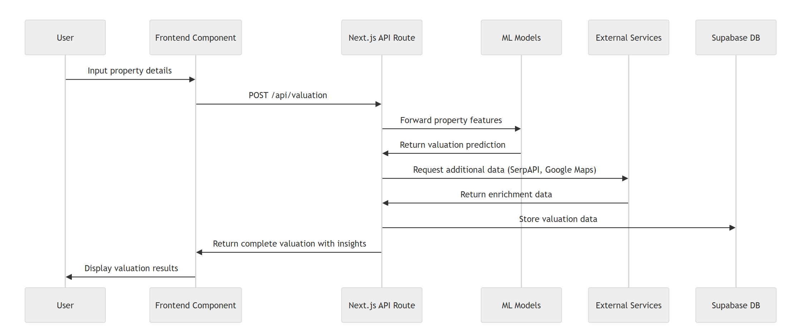

<p align="center">
  
</p>

# SECTION 1 : PROJECT TITLE
## ChatHDB - Singapore's Intelligent HDB Valuation & Analytics Engine

# SECTION 2 : EXECUTIVE SUMMARY
Navigating the Singapore HDB resale market requires more than just basic price lookups. Traditional valuation tools often rely on outdated averages or simplistic models, failing to capture the dynamic nuances of the market.

**ChatHDB** revolutionizes HDB valuation by combining advanced **Machine Learning** with **real-time market signals** – including Google Trends, news sentiment, and economic indicators. We provide not just a price estimate, but a comprehensive understanding of your property's value drivers, market position, and future potential, all delivered through an intuitive and modern interface.

Beyond Simple Estimates: Deep Insights, Dynamic Valuations, Comprehensive Market Context.

ChatHDB isn't just another valuation tool. Here's what sets us apart:

1.  **Multi-Factor Dynamic Valuation Engine:**
    *   **Beyond Static Models:** We go beyond simple averages. Our core model analyzes complex relationships between features (floor area, storey, lease).
    *   **Real-Time Pulse:** Crucially, our base ML valuation is dynamically adjusted using multipliers derived from:
        *   **Google Trends:** Gauging real-time search interest for your area.
        *   **News Sentiment Analysis:** Assessing market mood based on recent property news.
        *   **Economic Correlation:** Understanding how broader economic shifts (GDP, CPI, HDB Index, etc.) impact local prices.
    *   **Recency-Weighted:** We give significantly more weight to the most recent transactions (last 6 months) ensuring valuations reflect current market conditions.

2.  **Deeper, Unique Analytics:**
    *   **Economic Context:** Visualize exactly how your street's price trends correlate with key Singapore economic indicators (HDB Resale Index, GDP, CPI, Unemployment, Rental Index).
    *   **Comparative Performance:** Our unique animated "race chart" dynamically compares your street's price performance against other popular streets in the same town over time.
    *   **Lease Decay Insights:** Understand the long-term value impact with clear visualizations of how remaining lease affects price per square meter.
    *   **P3M Moving Averages:** Smooth out short-term noise and understand underlying price movements with 3-month moving averages.

3.  **AI-Powered Context & Narrative:**
    *   **Generative Reports:** Leverage Google Generative AI to provide concise, readable analysis reports synthesizing property data, transactions, and amenities.
    *   **Integrated Sentiment:** News sentiment isn't just displayed; it's quantified and directly feeds into the valuation adjustment multiplier.

# SECTION 3 : CREDITS / PROJECT CONTRIBUTION

| Official Full Name | Student ID | Email |
|-------------------|------------|------|
| **ONG QING QUAN** | e0641719 | e0641719@u.nus.edu |
| **AGUSTINUS BENYAMIN PRASETYO** | e1503301 | e1503301@u.nus.edu |
| **AVAN QUAK LI WEI** | e1509798 | e1509798@u.nus.edu |
| **LEONG KAY MEI** | e0324286 | e0324286@u.nus.edu |
| **YUAN LEI** | e1503308 | e1503308@u.nus.edu |

# SECTION 4 : VIDEO OF SYSTEM MODELLING & USE CASE DEMO

<div align="center">
  <h3>Promo Video</h3>
  <a href="https://www.youtube.com/watch?v=g7sjnaTnMUI" target="_blank">
    
  </a>
  <p><em>Watch our promo video to see ChatHDB in action!</em></p>
  
  <h3>Demo Video</h3>
  <a href="https://www.youtube.com/watch?v=sl_h2SFvX64" target="_blank">
    
  </a>
  <p><em>Watch our comprehensive demo to understand all the features of ChatHDB.</em></p>
</div>

# SECTION 5 : USER GUIDE

## Prerequisites
*   Node.js (v16.8.0 or higher recommended)
*   npm or Yarn

## Installation

1.  **Clone the repository:**
    ```bash
    git clone https://github.com/yourusername/chathdb.git
    cd chathdb
    ```

2.  **Install dependencies:**
    ```bash
    npm install
    # or
    yarn install
    ```

3.  **Set up environment variables:**
    *   Copy the example environment file:
        ```bash
        cp .env.example .env.local
        ```
    *   **Edit `.env.local`** and add your API keys.

4.  **Required API Keys:**
    *   `NEXT_PUBLIC_GOOGLE_MAPS_API_KEY`: For Google Maps features (Maps, Places). Ensure it's enabled for Maps JavaScript API, Places API, Geocoding API. **Crucially, restrict its usage to your domain(s) in the Google Cloud Console for security.**
    *   `GOOGLE_GENERATIVE_AI_API_KEY`: For Google's Generative AI features (e.g., property reports via Vertex AI or Gemini).
    *   `SERPAPI_KEY`: Required for fetching Google Trends and Top Stories data via the backend API routes.

5.  **Run the development server:**
    ```bash
    npm run dev
    # or
    yarn dev
    ```

6.  Open [http://localhost:3000](http://localhost:3000) in your browser.

# SECTION 6 : PROJECT REPORT

## Features

*   **Valuation & Core Insights:**
    *   **Instant ML Valuation:** Accurate price estimation using Random Forest.
    *   **Dynamic Adjustments:** Valuation refined by Google Trends, News Sentiment, and Economic Multipliers.
    *   **Feature Importance:** See what drives your property's value most.
    *   **Confidence Metrics:** Understand model accuracy (R²) and prediction intervals.
    *   **Price Per Square Meter:** Compare value density easily.
*   **Advanced Analytics:**
    *   **Historical Price Trends:** Visualize price movements for your street/flat type.
    *   **Economic Correlation Charts:** See links between property prices and macro indicators.
    *   **P3M Moving Averages:** Understand short-term market momentum.
    *   **Animated Area Comparison:** Dynamic bar chart race comparing street performance.
    *   **Lease Decay Analysis:** Visualize the impact of remaining lease on value.
    *   **AI Price Trend Forecasting:** Projections based on historical patterns.
*   **Market & Neighborhood Context:**
    *   **Top Stories & Sentiment:** Relevant property news with sentiment analysis.
    *   **Google Trends Integration:** See search interest correlation.
    *   **Nearby Amenities Mapping:** Interactive map showing schools, MRT, shops, parks with distances.
    *   **Neighborhood Comparison:** Contextualize your property within its local market.
*   **User Experience:**
    *   **Beautiful UI:** Modern, intuitive, responsive design (Tailwind CSS, shadcn/ui).
    *   **Interactive Maps:** Google Maps integration for spatial context.
    *   **Mobile Optimized:** Seamless experience on all devices.
    *   **Model Flow Explanation:** Understand the valuation process.

## Valuation Methodology: The ChatHDB Difference

Our valuation process is designed for accuracy and relevance in Singapore's dynamic HDB market:

1.  **Foundation: Random Forest Regression Model**
    *   **Training:** The model is trained on a vast dataset of historical HDB resale transactions.
    *   **Feature Engineering:** Key features are extracted and processed: Transaction Year/Month, Floor Area (sqm), Storey Range (categorized Low/Mid/High and averaged), Lease Commencement Year, and Calculated Remaining Lease.
    *   **Recency Weighting:** Recent transactions (last 6 months) are given significantly higher weight in the training data to ensure the model prioritizes current market dynamics.
    *   **Ensemble Prediction:** We run multiple prediction iterations with slight feature variations and use the median prediction for robustness against outliers.

2.  **Adjustment Layer: Incorporating Real-Time Signals**
    *   The **base valuation** from the Random Forest model is then refined using dynamically calculated multipliers:
        *   **Google Trends Multiplier (`M_trends`):** 
            * Based on analyzing 8 weeks of Google search trends for the specific town (e.g., SENGKANG).
            * 1. Extract trend values from recent data
            * 2. Calculate slope using linear regression
            * 3. Get town-specific adjustment factor 
            * 4. Normalize adjustment factor to 0-0.03 range
            * 5. Apply formula: 1.0 + (trend direction × normalized factor)
            * Trend direction is +1 (upward), -1 (downward), or 0 (neutral)
            
        *   **News Sentiment Multiplier (`M_sentiment`):** 
            * Based on analyzing top 5 recent news articles about the specific town (e.g., SENGKANG).
            * 1. Each article analyzed for sentiment: positive(+1), negative(-1), or neutral(0)
            * 2. Determine overall sentiment direction
            * 3. Get town-specific adjustment factor
            * 4. Normalize adjustment factor to 0-0.03 range
            * 5. Apply formula: 1.0 + (sentiment direction × normalized factor)
            * Sentiment direction is +1 (positive), -1 (negative), or 0 (neutral)
            
        *   **Economic Trend Multiplier (`M_economic`):**
            * Based on economic indicators like HDB Resale Index, GDP, CPI, and Rental Index.
            * 1. Analyze recent trend of economic indices
            * 2. Determine overall economic trend direction
            * 3. Get town-specific adjustment factor
            * 4. Normalize adjustment factor to 0-0.03 range
            * 5. Apply formula: 1.0 + (economic trend direction × normalized factor)
            * Economic trend direction is +1 (improving), -1 (declining), or 0 (stable)

3.  **Final Adjusted Valuation (`V_adjusted`)**
    *   The final valuation presented is calculated as:
        `V_adjusted = V_base × M_trends × M_sentiment × M_economic`
    *   This ensures the estimate reflects not only historical patterns but also current market interest, sentiment, and broader economic forces.

4.  **Supporting Metrics:**
    *   **Prediction Interval:** Provides a statistically derived range (e.g., 85%-120% of the estimate) where the actual transaction price is likely to fall.
    *   **Model Metrics:** R² score, Mean Absolute Error (MAE), and Mean Squared Error (MSE) are calculated to provide transparency on model performance.
    *   **Feature Importance:** Calculated using permutation and direct methods to show the relative influence of each input feature on the final price.

## ChatHDB Valuation Flow

<p align="center">
  
</p>

Our valuation process follows a robust workflow:

1. The User inputs property details via the Frontend.
2. The Frontend sends a request to the Next.js API Route.
3. The API route gets a base prediction from the ML Model using property features.
4. It then enriches this by fetching real-time data (Trends, News, Maps) from External Services.
5. The API route combines the prediction and enrichment data to calculate the final adjusted valuation and insights.
6. *(Future: Results will be stored in Supabase DB.)*
7. The complete valuation is returned to the Frontend and displayed to the User.

## Technology Stack

We use a modern, robust technology stack chosen for performance, developer experience, and analytical power:

*   **Frontend:**
    *   **Next.js 13.5+:** For performance (SSR/ISR), routing, and a great React framework experience.
    *   **React 18:** For building interactive user interfaces efficiently.
    *   **Tailwind CSS:** Utility-first CSS framework for rapid, consistent styling.
    *   **shadcn/ui:** Beautifully designed, accessible UI components built on Radix UI and Tailwind.
    *   **Framer Motion:** For smooth animations and transitions.
*   **Data Visualization:**
    *   **Nivo:** Rich, declarative charting library for React (used for Line, Bar, Pie charts).
    *   **Recharts:** Alternative powerful charting library.
*   **Mapping:**
    *   **Google Maps API (JS API Loader):** For interactive maps, geocoding (via OneMap), and amenity finding.
*   **Data Processing & ML:**
    *   **Papa Parse:** For efficient client-side CSV parsing of HDB data.
    *   **xgboost:** API route to implement pre-trained xgboost model
*   **AI Integration:**
    *   **Google Generative AI:** For generating property analysis reports and potentially other AI-driven insights.
*   **State Management:** React Hooks (useState, useEffect, useMemo, useCallback).
*   **Utilities:** Lucide React (icons), Sonner (toast notifications).

# SECTION 7 : MISCELLANEOUS

## License

This project is licensed under the MIT License - see the `LICENSE` file for details.

