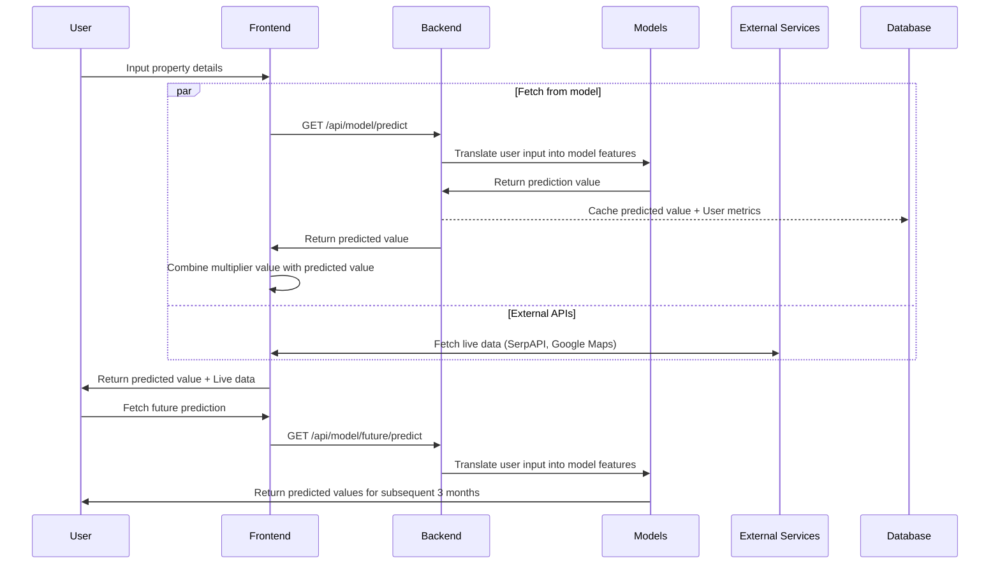

```mermaid
sequenceDiagram
    participant User
    participant Frontend
    participant Backend
    participant Models
    participant External Services
    participant Database

    User->>Frontend: Input property details

    par Fetch from model
        Frontend->>Backend: GET /api/model/predict
        Backend->>Models: Translate user input into model features
        Models->>Backend: Return prediction value
        Backend-->>Database: Cache predicted value + User metrics
        Backend->>Frontend: Return predicted value
        Frontend->>Frontend: Combine multiplier value with predicted value
    and External APIs
        External Services<<->>Frontend: Fetch live data (SerpAPI, Google Maps)
    end
    Frontend->>User: Return predicted value + Live data

    User->>Frontend: Fetch future prediction
    Frontend->>Backend: GET /api/model/future/predict
    Backend->>Models: Translate user input into model features
    Models->>User: Return predicted values for subsequent 3 months

```
